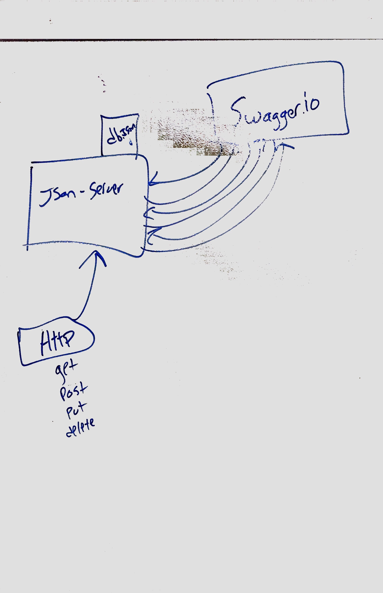

# LAB - 06 - simple-api

# swaggerhub url: https://app.swaggerhub.com/apis/jonagray/default-title/0.1

### Author: Jonny Graybill

### Links and Resources
* [submission PR](https://github.com/401-advanced-javascript-jonnygraybill/simple-api/pull/1)

* [swaggerhub url](https://app.swaggerhub.com/apis/jonagray/default-title/0.1)

* Worked with the entire 401 group to finish this lab

### UML

